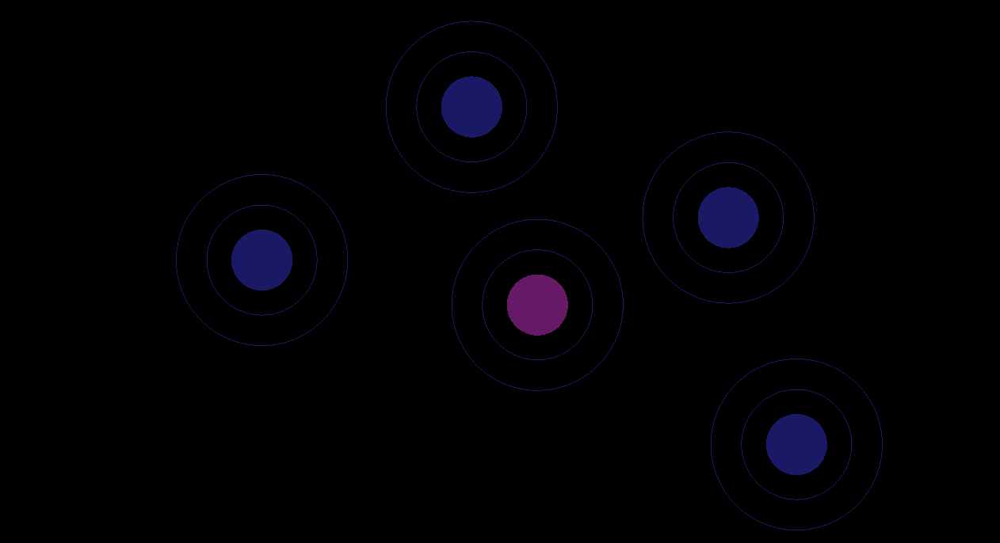

# DragFigureGL
OpenGL Object Drag &amp; Drop

Use Visual Studio 2019 to compile and test
## Controls

F1 - switch from fullscreen to windowed

Arrows - move camera

PageUp, PageDown - zooming

## Enjoy!

Objects at program start:

Now you can use mouse to click and activate the object (look like an Atom) 

to group them into Molecula

