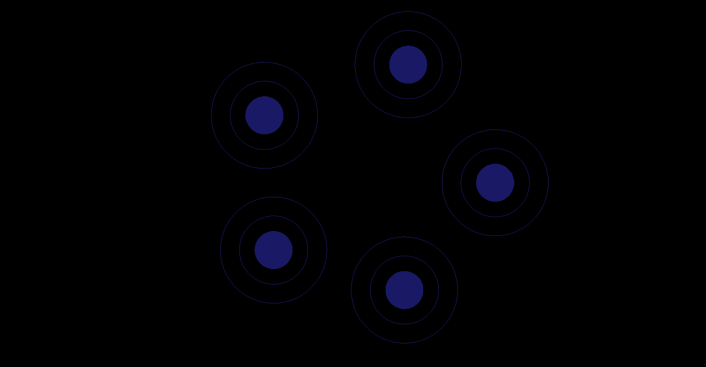

# DragFigureGL
OpenGL Object Drag &amp; Drop

Use Visual Studio 2019 to compile and test

Enjoy!

Object at start:

Now you can use mouse to click and activate the object (look like some Atom) to drag them to Molecula

