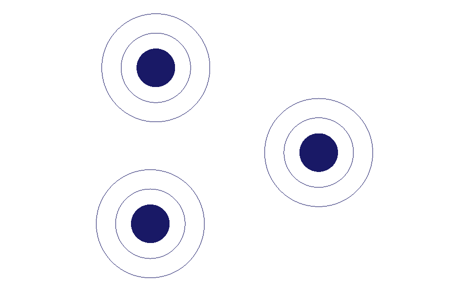
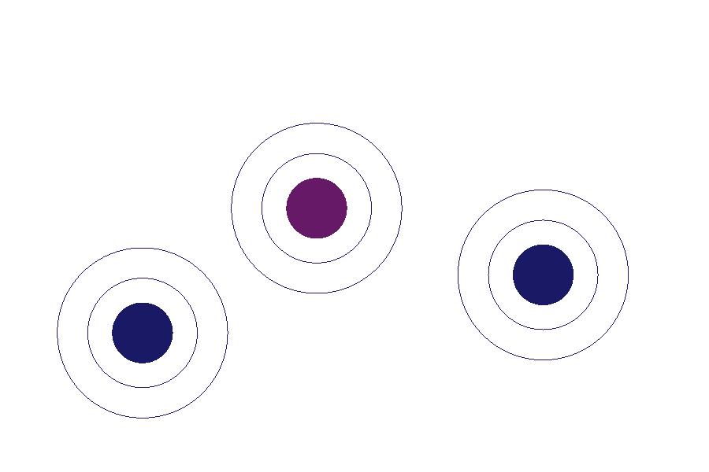

# DragFigureGL
OpenGL Object Drag &amp; Drop

Use Visual Studio 2019 to compile and test

## Enjoy!

Objects at program start:

Now you can use mouse to click and activate the object (look like an Atom) 
to group them in Molecula

